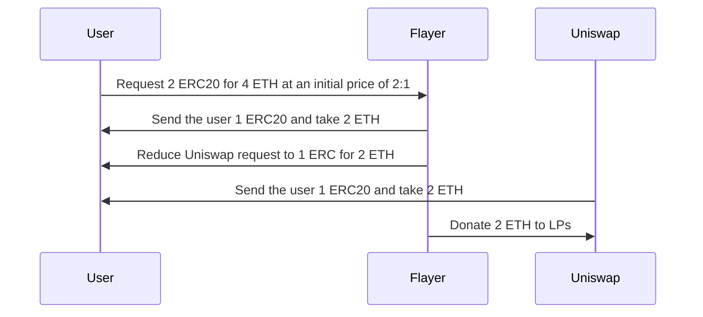
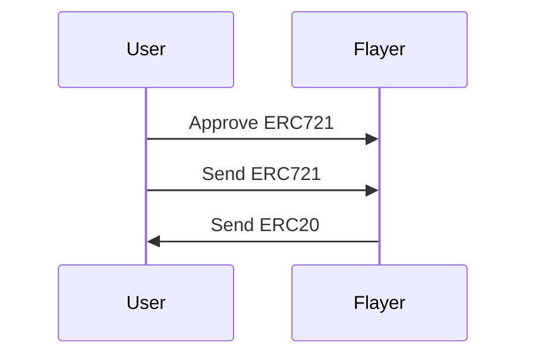
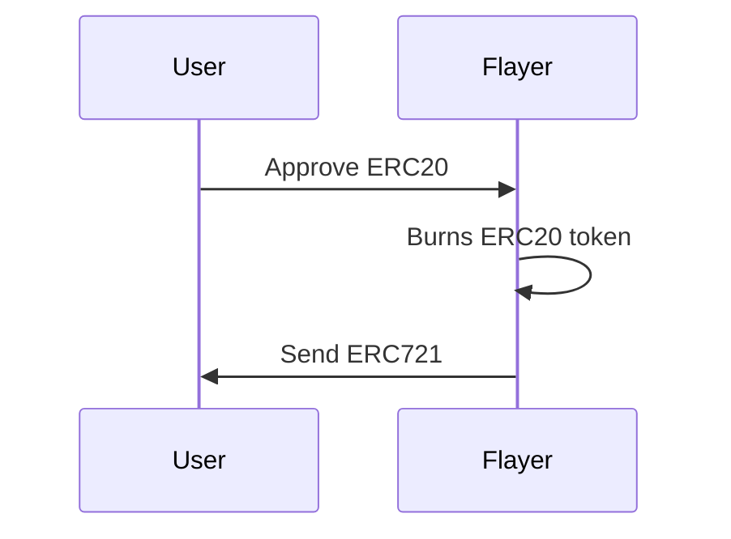
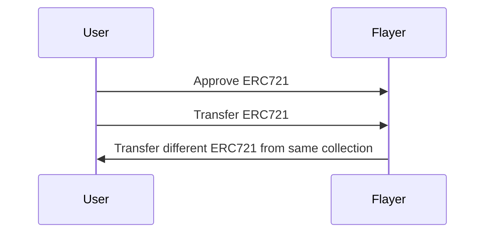
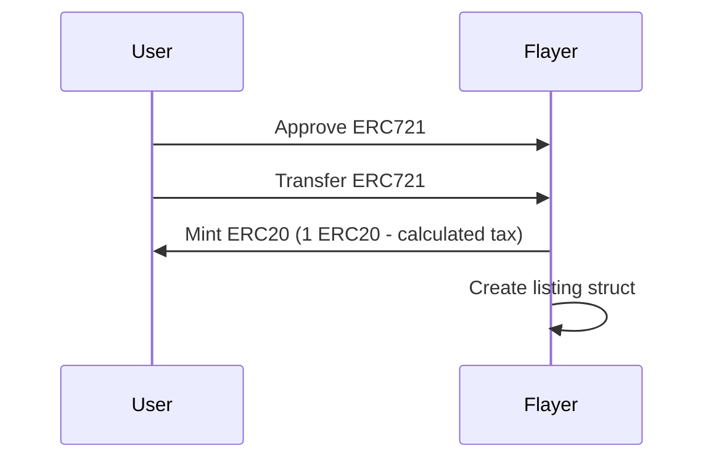
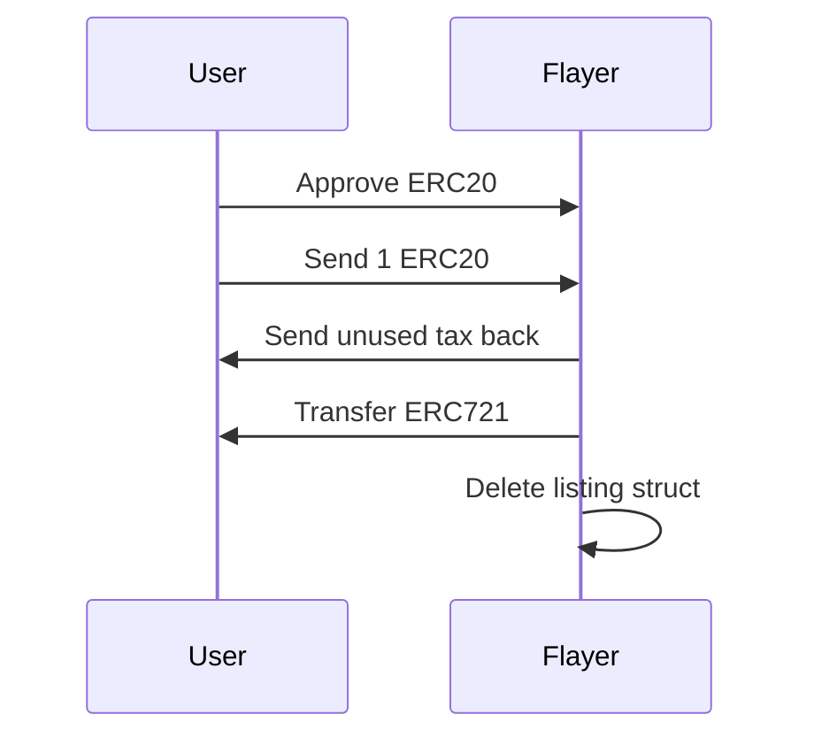
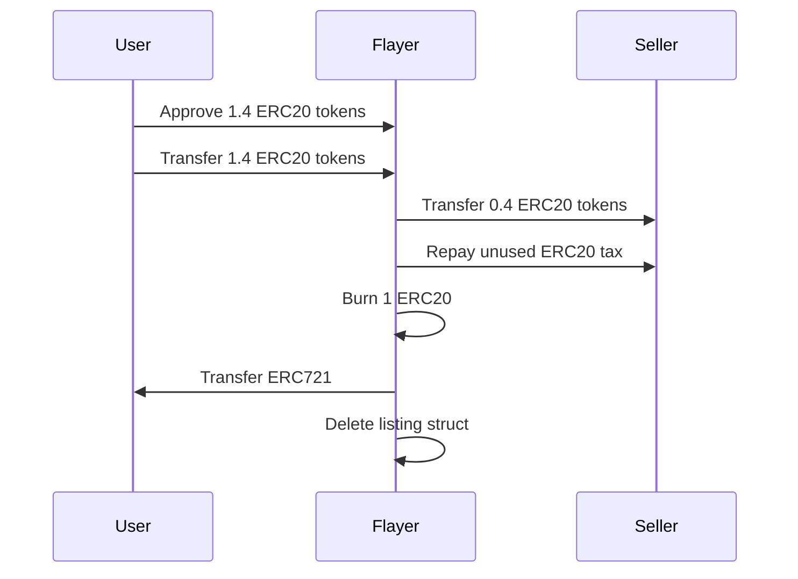

## Packages

The required packages for the codebase are included in the `.gitmodules` file, including the required `branch` that these will need to import.

At the time of writing the Uniswap V4 project has just entered a code freeze ahead of an audit. From the output of this audit the code dependency could change on the `main` branch.

## Custom Denominations

When a collection is registered with Flayer, it is possible to set a custom denomination value to promote a more "MEME token" vibe.

## Internal Swap Logic

Flayer implements a novel internal swap mechanism that aims to prevent slippage within the pool whilst converting pool rewards from an unwanted token, the CollectionToken (CT), into a wanted token, an ETH equivalent token (EET).

We achieve this by collecting our taxes in CT, which would be undesirable to the LPs as they would just end up dumping the token. When we detect a swap via Uniswap V4 we frontrun the swap to first convert CT into EET at the current pool price.

This prevents the pool price from being affected, whilst also converting fees to EET, which is much more desirable to LPs and will subsequently be distributed in `afterSwap` or around liquidity transactions.

The amount transacted is then removed from the upcoming Uniswap swap transaction.

## Sequence Diagrams

In these diagrams I make reference to ETH. This, however, refers to an ETH equivalent token such as WETH or flETH. These must be wrapped before the transaction as this is not handled at the protocol level.

### Deposit

Takes an approved ERC721 from the user and mints it into the ERC20 equivalent token.

### Redeem

Allows the sender to burn an ERC20 token and receive a specified ERC721.

### Swap

Replaces a token in the vault with another token, assuming that both are floor value. This can also
be done using `swapBatch` that just sends in multiple and receives multiple.

### Create Liquid Listing

Allows a token to be listed at an amount higher than the default 1 token. The lister will still receive their 1 token instantly as if they called `deposit`.

### Cancel Listing

Allows a listing the be cancelled for 1 equivalent token and will refund any remaining taxes that are present in the contract for that token ID listing.

### Fill Liquid or Dutch Listing

Fills a listing using ERC20 token. The following example assumes a listing price of 1.40. In this example, a dutch auction could have also reached the 1.40 price at point of fill.

A dutch listing price is calculated

